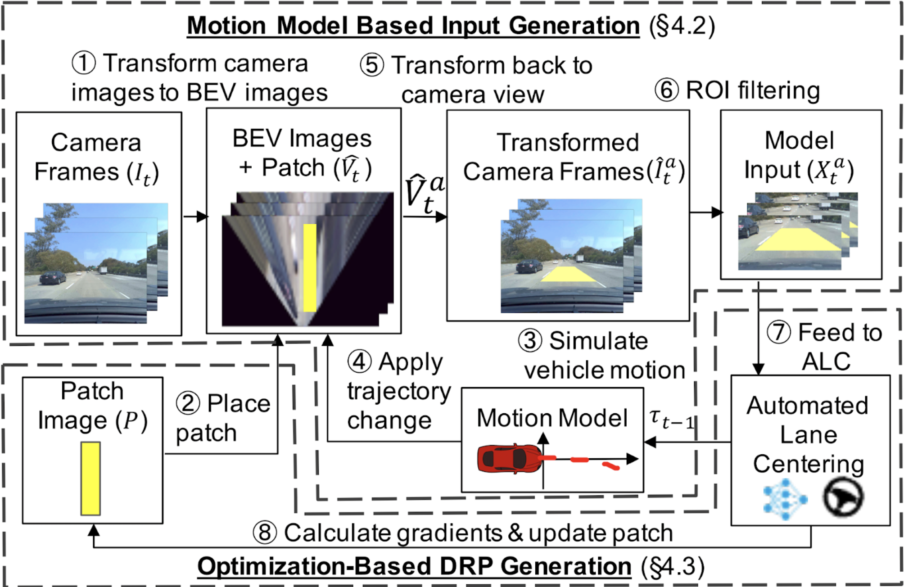
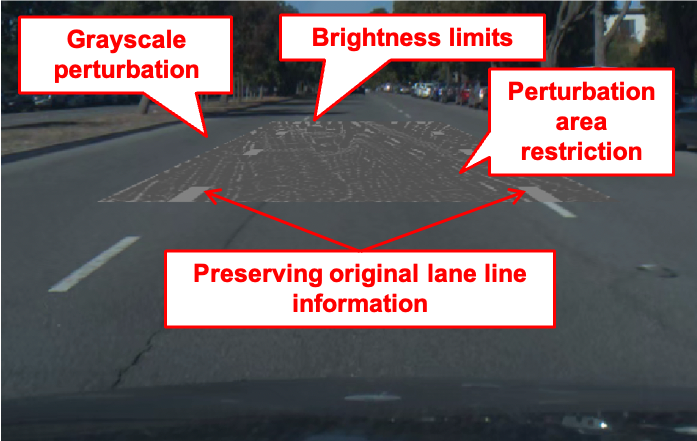

# DRP-attack

This repository holds the source code for Dirty Road Patch (DRP) attack, a novel domain-specific adversarial attacks against Automated Lane Centering (ALC) system proposed in the paper([proceedings](https://www.usenix.org/conference/usenixsecurity21/presentation/sato), [extended version](https://arxiv.org/abs/2009.06701)) "_Dirty Road Can Attack: Security of Deep Learning based Automated Lane Centering under Physical-World Attack_", by Takami Sato, Junjie Shen, and Ningfei Wang (University of California, Irvine); Yunhan Jia (ByteDance); Xue Lin (Northeastern University); Qi Alfred Chen (University of California, Irvine). For attack demos and more results, please refer to [our project website](https://sites.google.com/view/cav-sec/drp-attack/).



# Requierment

- Python 3.7.6 or higher
- Tensorflow 1.15.0
- Ubuntu 18.04
- CUDA 10.1

# Installation

- Clone this repository. Assume this repositry is downloaded to `/foobar/DRP-attack/`.
- Install dependencies
    - `cd /foobar/DRP-attack/`
    - `pip install -r requirements.txt`
- Clone OpenPilot v0.6.6 under DRP attack directory, i.e., `/foobar/DRP-attack/openpilot`.
    -  `git clone https://github.com/commaai/openpilot -b v0.6.6`
- Install capnp
    - `cd /foobar/DRP-attack/openpilot/phonelibs`
    - `sudo sh install_capnp.sh`
- Compile messaging
    - `cd /foobar/DRP-attack/openpilot/selfdrive/messaging`
    - `PYTHONPATH=$PYTHONPATH:/foobar/DRP-attack/openpilot/  make`
- Compile libmpc
    - `cd /foobar/DRP-attack/openpilot/selfdrive/controls/lib/lateral_mpc`
    - `find ./ -name "*.o" | xargs rm`
    - `make all`
- Install OpenCL
    - `sudo apt install beignet-opencl-icd ocl-icd-libopencl1 clinfo`

# Usage

This repository has a highway scenarios.

```bash
### attack to left
python run_patch_generation.py data/scenarios/highway/sc1/config_left.json
### attakc to right
python run_patch_generation.py data/scenarios/highway/sc1/config_right.json
```

You may also check Demo notebook `Demo.ipynb`.

# Reproduction

## Real-World Trace-Based Evaluation


* Download comma2k19 dataset as described in https://github.com/commaai/comma2k19.
* Place the driving traces of 40 scenarios (20 highway and 20 local) in the `data/scenario/` directory like `data/scenarios/highway/sc1/`.
    * The path to each scenario is in `data/realworld_trace_scenarios.csv`
    * The configuration of each scenario is in `realworld_trace_configs.zip`
* Run the experiments for all scenarios. Please set `road_type` and `scenario_number`.
```bash
### attack to left
python run_patch_generation.py data/scenarios/${road_type}/sc${scenario_number}/config_left.json
### attakc to right
python run_patch_generation.py data/scenarios/${road_type}/sc${scenario_number}/config_right.json
```

### Reproduction of Defenses and Baseline Attcks

The code for each defenses and baseline attacks is in the following branch.

* baseline_drawing_lane_line
* baseline_single_frame_eot
* defense_autoencoder
* defense_bit_depth_reduction
* defense_gaussian_noise
* defense_jpeg_compression
* defense_median_blur

## Physical-World Miniature-Scale Experiments

* Generate a patch with this DRP attack code as in real-World trace-based evaluation.
* Convert the obtained patch with the color mapping to handle the difference between printed color and observed color.
    * Details are in `Color_map_creation_for_physical_world_exp.ipynb`.


## Software-in-the-Loop Simulation

* Generate a patch with this DRP attack code as in real-world trace-based evaluation.
* Convert the obtained patch with the color mapping to handle the difference between printed color and observed color.
    * Apply the same methodology described in `Color_map_creation_for_physical_world_exp.ipynb`.
* Place the obtained  in LGSVL simulator and run OpenPilot with LGSVL bridge.
    * Detailed setups are descrived in the [OpenPilot-LGSVL bridge repository](https://github.com/ASGuard-UCI/openpilot/blob/lgsvl_bridge/README_DRP_ATTACK.md).


# Citation

```bibtex
@inproceedings{sec:2021:sato:drpattack,
  title={{Dirty Road Can Attack: Security of Deep Learning based Automated Lane Centering under Physical-World Attack}},
  author={Takami Sato and Junjie Shen and Ningfei Wang and Yunhan Jia and Xue Lin and Qi Alfred Chen},
  booktitle={Proceedings of the 29th USENIX Security Symposium (USENIX Security '21)},
  year={2021}
}
```

# Acknowledgement

Great thanks to [OpenPilot](https://github.com/commaai/openpilot), [Comma2k19 dataset](https://github.com/commaai/comma2k19), [TensorFlow](https://github.com/tensorflow/tensorflow), and all other libraries.

